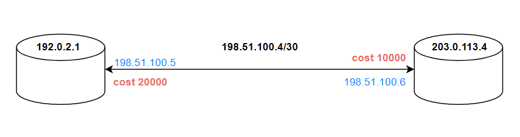

Адаптация алгоритма Дейкстры для расчёта кратчайших путей в IP-сетях.
-
Изначально алгоритм предназначен для **направленных графов** с положительными весами рёбер. Направленный означает, что пройти по нему можно **только в одном направлении**. В ip-сетях это требование, на первый взгляд, кажется невыполнимым. Любой интерфейс или порт является дуплексным, т.е. может как принимать, так и отправлять данные. Каждое ребро в реальной сети ненаправленно. 

Простая замена **одно такого ребра на два ненаправленных** позволяет обойти ограничение.

В данной реализации направленному ребру было дано название "линк смежности" **(adjacency link)**. 
Между каждыми двумя узлами должно быть по два линка смежности.

Полное описание графа это массив из таких линков, каждый из которых представлен структурой :

    struct {
        u32i nodeID;
        u32i localIP;
        u32i mask;
        u32i cost;
        u32i neighIP;
        u32i neighID;
    };

Здесь и далее u32i это краткая запись для типа uint32_t и является полным аналогом адреса IPv4.

|переменная  | описание |
|--|--|
| nodeID | идентификатор узла в виде ip-адреса |
| localIP| ip-адрес на локальном интерфейсе этого узла
| mask   | маска интерфейса
| cost   | локальная стоимость интерфейса в диапазоне : 1 - 65535
|        | ( лупбеки могут иметь стоимость = 0 )
| neighIP| ip-адрес на удалённом интерфейсе
| neighID| идентификатор удалённого узла в виде ip-адреса

Пара любых соседних узлов требует **две** записи типа adjLnk.

Например следующая простейшая топология : 
  
описывается двумя линками смежности :  
|NodeID|localIP|mask|cost|neighIP|neighID|  
|--|--|--|--|--|--|
|192.0.2.1|198.51.100.5|255.255.255.252|20000|198.51.100.6|203.0.113.4  
|203.0.113.4|198.51.100.6|255.255.255.252|10000|198.51.100.5|192.0.2.1  

Стоимость линка с противоположных сторон может отличаться (в нашем случае 10'000 vs 20'000). Это нормальная практика для современных сетей.

Дизайн проекта
-
В основе лежат два класса :

 - **GraphIPv4** - сам граф
 - **DjkIPv4** - дерево, получаемое из графа

В первую очередь необходимо пополнить линками объект класса GraphIPv4. Затем передать граф в конструктор DjkIPv4 для расчёта дерева кратчайших путей.

Для пополнения графа используются методы :

    void addLink(nodeIDv4_t nodeID, linkAdjv4_t link); // добавляет один линк смежности
    void addLinks(vector <linkAdjStr_t> *table);  // добавляет все линки смежности из переданной таблицы
    void addLinksFromFile(const string &fn); // загружает все линки смежности из двоичного файла

В случае простых топологий можно вносить каждый линк через отдельные вызовы `::addLink()`, либо построить вектор и передать его в `::addLinks()`.

Метод пополнения из двоичного файла `::addLinksFromFile()` больше подходит для крупной базы данных, взятой из реальной сети. 

Если имеется доступ к боевому маршрутизатору **Cisco ASR**, работающему под **IOS XR**, то можно воспользоваться утилитой **xroconv** (XR OSPF Converter). В текстовый файл собирается вывод команды "**show ospf database router**" и передаётся на обработку утилите. Утилита выложена в архиве **xroconv.zip**. К сожалению поддерживаюсят только анонсы типа LSA Type 1, другие не учитываются. Сгенерированный файл представляет собой бинарник из записей типа adjLnk, следующих один за другим без каких-либо дополнительных разделителей. Порядок байтов в файле : младшие идут первыми (при разглядывании в hex-редакторе, ip-адреса будут в перевёрнутом виде).

Компиляция полного проекта из main.cpp даст рабочую утилиту, в аргументах к которой передаётся полученный двоичный файл. После расчёта дерева кратчайших путей на экран выводится результирующая таблица маршрутизации (**Router Information Base**).

В реальных сетях, построенных по технологии Ethernet и не только, могут возникать интересные особенности. Например, несколько узлов, включенных в один широковещательный домен через коммутатор. Для полного описания такой топологии понадобится n * (n - 1) направленных линков смежности (т.е. в два раза больше ненаправленных). А поскольку это задача того, кто подготавливает таблицу линков, а не самого алгоритма, можем считать, что алгоритму всё-равно какого типа физическое подключение : широковещательное, точка-точка или множественный доступ без широковещания. Главное описать все возможные линки смежности на данном сегменте сети между всеми парами узлов.

В протоколе **OSPF**, а это, наряду с **IS-IS**, один из основных "пользователей" алгоритма Дейкстры, встречаются параллельные пути с одинаковой стоимостью, обычно называемые **equal-cost multi-path (ECMP)**.  В этой реализации параллельные пути учтены.

