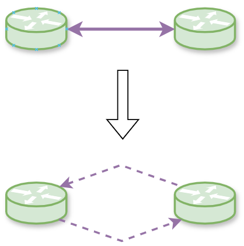
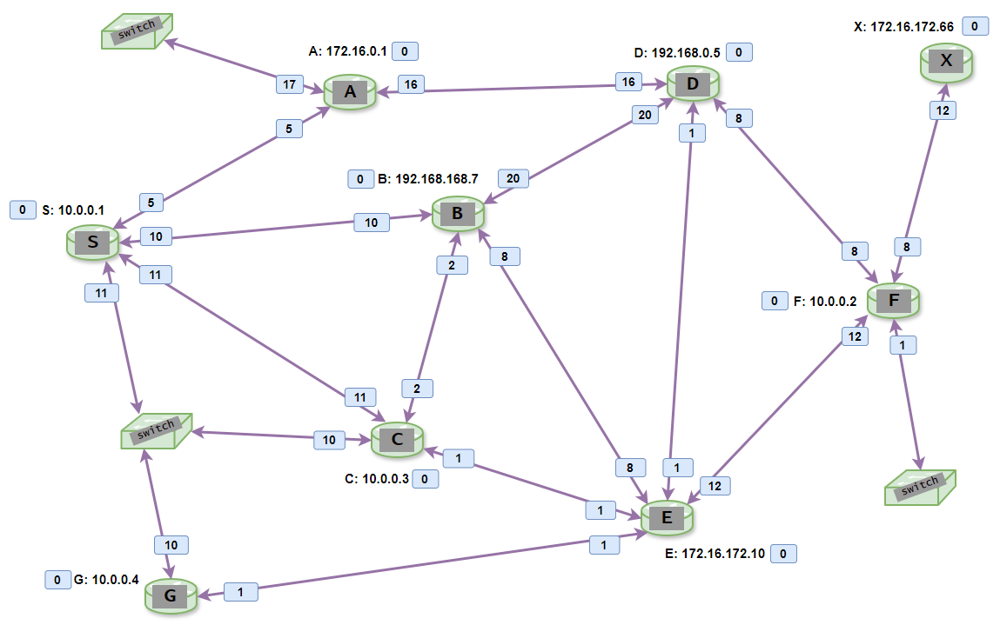
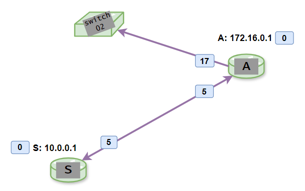
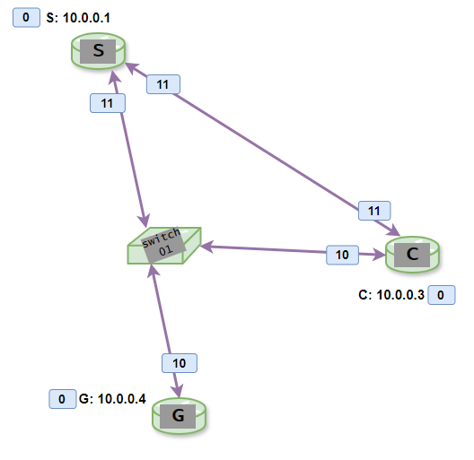
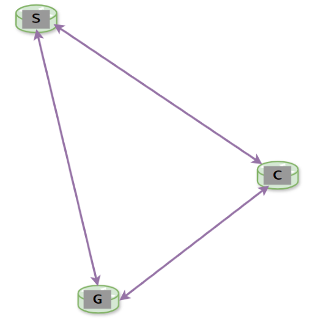
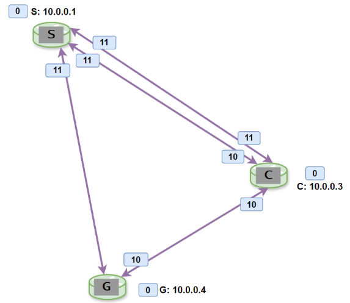

Адаптация алгоритма Дейкстры для расчёта кратчайших путей в IP-сетях.
-
Изначально алгоритм предназначен для **направленных графов** с положительными весами рёбер. Направленный означает, что пройти по нему можно **только в одном направлении**. В ip-сетях это требование, на первый взгляд, кажется невыполнимым. Любой интерфейс или порт является дуплексным, т.е. может как принимать, так и отправлять данные. Каждое ребро в реальной сети ненаправленно. 

Простая замена **одного такого ребра на два направленных** позволяет обойти ограничение:

  

В данной реализации направленному ребру было дано название "линк смежности" **(adjacency link)**. 
Между каждыми двумя узлами должно быть по два линка смежности.

Полное описание графа это массив из таких линков, каждый из которых представлен структурой :

    struct {
        u32i nodeID;
        u32i localIP;
        u32i mask;
        u32i cost;
        u32i neighIP;
        u32i neighID;
    };

Здесь и далее u32i это краткая запись для типа uint32_t и является полным аналогом адреса IPv4.

|переменная  | описание |
|--|--|
| nodeID | идентификатор узла в виде ip-адреса |
| localIP| ip-адрес на локальном интерфейсе этого узла
| mask   | маска интерфейса
| cost   | локальная стоимость интерфейса в диапазоне : 1 - 65535
|        | ( лупбеки могут иметь стоимость = 0 )
| neighIP| ip-адрес на удалённом интерфейсе
| neighID| идентификатор удалённого узла в виде ip-адреса

Пара любых соседних узлов требует **две** записи типа adjLnk.

Например следующая простейшая топология : 
  
описывается двумя линками смежности :  
|NodeID|localIP|mask|cost|neighIP|neighID|  
|--|--|--|--|--|--|
|192.0.2.1|198.51.100.5|255.255.255.252|20000|198.51.100.6|203.0.113.4  
|203.0.113.4|198.51.100.6|255.255.255.252|10000|198.51.100.5|192.0.2.1  

Стоимость линка с противоположных сторон может отличаться (в нашем случае 10'000 vs 20'000). Это нормальная практика для современных сетей.

Дизайн библиотеки
-
В основе лежат два класса :

 - **GraphIPv4** - граф
 - **DjkIPv4** - дерево

В первую очередь необходимо пополнить линками объект класса GraphIPv4. Затем передать граф в конструктор DjkIPv4 для расчёта дерева кратчайших путей.

Для пополнения графа используются методы :

    void addLink(nodeIDv4_t nodeID, linkAdjv4_t link); // добавляет один линк смежности
    void addLinks(vector <linkAdjStr_t> *table);  // добавляет все линки смежности из переданной таблицы
    void addLinksFromFile(const string &fn); // загружает все линки смежности из двоичного файла

В случае простых топологий можно вносить каждый линк через отдельные вызовы `::addLink()`, либо построить вектор и передать его в `::addLinks()`.

Метод пополнения из двоичного файла `::addLinksFromFile()` больше подходит для крупной базы данных, взятой из реальной сети. 

Если имеется доступ к боевому маршрутизатору **Cisco ASR**, работающему под **IOS XR**, то можно воспользоваться утилитой **xroconv** (XR OSPF Converter). В текстовый файл собирается вывод команды "**show ospf database router**" и передаётся на обработку утилите. Утилита выложена в архиве **xroconv.zip**. К сожалению поддерживаюсят только анонсы типа LSA Type 1, другие не учитываются. Сгенерированный файл представляет собой бинарник из записей типа adjLnk, следующих один за другим без каких-либо дополнительных разделителей. Порядок байтов в файле : младшие идут первыми (при разглядывании в hex-редакторе, ip-адреса будут в перевёрнутом виде).

Компиляция полного проекта из main.cpp даст рабочую утилиту, в аргументах к которой передаётся полученный двоичный файл. После расчёта дерева кратчайших путей на экран выводится результирующая таблица маршрутизации (**Router Information Base**).

В реальных сетях, построенных по технологии Ethernet и не только, могут возникать интересные особенности. Например, несколько узлов, включенных в один широковещательный домен через коммутатор. Для полного описания такой топологии понадобится n * (n - 1) направленных линков смежности (т.е. в два раза больше ненаправленных). А поскольку это задача того, кто подготавливает таблицу линков, а не самого алгоритма, можем считать, что алгоритму всё-равно какого типа физическое подключение : широковещательное, точка-точка или множественный доступ без широковещания. Главное описать все возможные линки смежности на данном сегменте сети между всеми парами узлов.

В протоколе **OSPF**, а это, наряду с **IS-IS** и **CSPF TE**, один из основных "пользователей" алгоритма Дейкстры, встречаются параллельные пути с одинаковой стоимостью, обычно называемые **equal-cost multi-path (ECMP)**.  В данном коде параллельные пути учтены.

Пример топологии
-
Рассмотрим пример сети, построенной на основе протокола IPv4 :

Любой интерфейс между двумя маршрутизаторами это ненаправленное ребро, раскладывающееся на два линка смежности, что упоминалось выше. Адресация интерфейсов (ip-сегментов) не приводится, чтобы не загромождать рисунок. Указаны только loopback-сети и локальные стоимости всех интерфейсов. Loopback - тоже интерфейс, требующий только одного линка смежности. На рисунке указаны и два "тупиковых" сегмента, смотрящие в сторону коммутаторов switch02 и switch03. Термин "тупиковый" в разных контекстах может означать немного разные понятия. В нашем примере такие сегменты не имеют соседних узлов. Тупиковое ребро тоже описывается лишь одним линком смежности, о чём будет ниже.

Стоимость (cost) рассчитывается для разных сущностей :

 - локальная стоимость интерфейса (1 - 65535)
 - локальная стоимость подключенного ip-сегмента (1 - 65535)
 - кумулятивная стоимость маршрута до удалённого узла (0 - UINT32MAX)
 - кумулятивная стоимость маршрута до удалённого ip-сегмента (1 - UINT32MAX)

Кумулятивная значит суммарная, т.е. сумма всех участков пути от source до destination. Суммарная стоимость 0 может быть только у корневого узла, и это важное исходное значение, без которого алгоритм не начнёт правильно работать. Каждый узел рассматривает себя в качестве корневого, и каждый рассчитывает свою копию дерева кратчайших путей до всех остальных узлов сети.

Локальная стоимость ip-сегмента автоматически = локальной стоимости интерфейса, которому назначен этот сегмент.

Рассчитываются пути именно до узлов, а не до ip-сегментов. Получив стоимость пути до узла, мы получаем и кумулятивную стоимость любого ip-сегмента, подключенного к узлу :

*кумулятивная стоимость ip-сегмента = сумме кумулятивной стоимости узла и локальной стоимости интерфейса, которому назначен ip-адрес из данного сегмента.*

Здесь и далее будем считать, что уникальное имя интерфейса это назначенный ему ip-адрес.

В файле **example_table.h** содержится вектор всех линков смежности, описывающих данную топологию. Рассмотрим несколько примеров из этого файла :

    ...
    {"10.0.0.1", "10.254.241.2", "255.255.255.252", 5, "10.254.241.1", "172.16.0.1"}, // S to A
    ...
    {"172.16.0.1","10.254.241.1", "255.255.255.252", 5, "10.254.241.2", "10.0.0.1"} // A to S
    ...
    {"172.16.0.1","8.8.8.2", "255.255.255.0", 17, "0.0.0.0", "0.0.0.0"}, // A to switch (stub, no neighbor)
    ...
    {"10.0.0.1", "10.0.0.1", "255.255.255.255", 0, "10.0.0.1", "10.0.0.1"},  // loopback S
    {"172.16.0.1", "172.16.0.1", "255.255.255.255", 0, "172.16.0.1", "172.16.0.1"},  // loopback A

|NodeID|localIP|mask|cost|neighIP|neighID|  
|--|--|--|--|--|--|
|10.0.0.1|10.254.241.2|255.255.255.252|5|10.254.241.1|172.16.0.1
|172.16.0.1|10.254.241.1|255.255.255.252|5|10.254.241.2|10.0.0.1
|172.16.0.1|8.8.8.2|255.255.255.0|17|0.0.0.0|0.0.0.0
|10.0.0.1|10.0.0.1|255.255.255.255|0|10.0.0.1|10.0.0.1
|172.16.0.1|172.16.0.1|255.255.255.255|0|172.16.0.1|172.16.0.1

Первые две строки описывают ненаправленное ребро, т.е. нетупиковый сегмент сети, между узлами S и A (либо A и S, что одно и то же). Поскольку это полноценные маршрутизаторы, то здесь **два** линка смежности для одного сегмента.

Третья строка описывает тупиковый сегмент, т.к. за коммутатором switch02 нет других маршрутизаторов. Именно поэтому поля neighIP и neighID равны 0.0.0.0, что тоже важный момент, на который стоит обратить внимание. С помощью таких значений мы указываем коду не искать узлы за данным интерфейсом.

Последние две строки описывают лупбеки. Как и тупиковые сети, они не участвуют в рассчётах. Лупбек это локальный петлевой интерфейс, как бы смотрящий обратно на узел. Маска не всегда /32, но вот поля localIP, neighIP, neighID обязательно должны быть равны NodeID.

Теперь рассмотрим другой интересный участок :  

Коммутаторы L2-уровня не являются участниками ip-сетей и в алгоритме кратчайших путей не участвуют. Они являются мостами для организации взаимодействия подключенных маршрутизаторов, позволяя экономить физические порты роутеров и уменьшать количество настроек.

Через коммутатор switch01 три маршрутизатора образуют смежность друг с другом. Виртуально организуются три ненаправленных ребра :

Но у нас был ещё один линк не через свитч, вернём его сюда. Вот что получилось  :

Верхние два параллельных ненаправленных ребра в реальных сетях используются для балансировки нагрузки. Их могут агрегатировать в один интерфейс, либо оставить разделёнными, тогда алгоритм Дейкстры обнаружит два параллельных пути от S до C с одинаковой стоимостью 11. В обратную сторону от C до S стоимости окажутся разными (10 vs 11), и будет выбран только один линк со стоимостью 10. Вообще стоит сказать, что изначально алгоритм не работает с ECMP. Небольшие доработки кода позволили обучить его и этому.

Следующие линки смежности описывают вышеобозначенный кусок сети :

    {"10.0.0.1", "10.254.241.49", "255.255.255.248", 11, "10.254.241.50", "10.0.0.3"}, // S to C
    {"10.0.0.1", "10.254.241.45", "255.255.255.252", 11, "10.254.241.46", "10.0.0.3"}, // S to C
    {"10.0.0.1", "10.254.241.49", "255.255.255.248", 11, "10.254.241.51", "10.0.0.4"}, // S to G
    
    {"10.0.0.3","10.254.241.50", "255.255.255.252", 10, "10.254.241.49", "10.0.0.1"}, // C to S
    {"10.0.0.3","10.254.241.46", "255.255.255.252", 11, "10.254.241.45", "10.0.0.1"}, // C to S
    {"10.0.0.3","10.254.241.50", "255.255.255.252", 10, "10.254.241.51", "10.0.0.4"}, // C to G
    
    {"10.0.0.4","10.254.241.51", "255.255.255.248", 10, "10.254.241.49", "10.0.0.1"}, // G to S
    {"10.0.0.4","10.254.241.51", "255.255.255.252", 10, "10.254.241.50", "10.0.0.3"}, // G to C
    
    {"10.0.0.1", "10.0.0.1", "255.255.255.255", 0, "10.0.0.1", "10.0.0.1"}, // loopback S
    {"10.0.0.3","10.0.0.3", "255.255.255.255", 0, "10.0.0.3", "10.0.0.3"}, // loopback C
    {"10.0.0.4","10.0.0.4", "255.255.255.255", 0, "10.0.0.4", "10.0.0.4"}, // loopback G

Пример проекта
-
У нас есть исходные данные, теперь можно написать несложный код для рассчёта кратчайших путей.
Файл main.cpp из представленных здесь мы использовать не будем. Напишем другой.
Нам понадобится подключить к новому проекту следующие файлы:

    gia_ipmnp.h // из соседнего репо
    gia_ipmnp.cpp // из соседнего репо
    gia_djk.h
    gia_djk.cpp
    example_table.h

И примерно такой код напишем в новом main.cpp :

    #include <iostream>
    #include "gia_ipmnp.h"
    #include "gia_djk.h"
    #include "example_table.h"
    
    using namespace std;
    extern const array <string,4> djkStStr;
    
    int main()
    {
        GraphIPv4 graph01;
        graph01.addLinks(&adjVec);
        graph01.printGraph();
    
        DjkIPv4 tree01(v4mnp::to_u32i("10.0.0.1"), &graph01, true);
        cout << " Dijkstra state : " << djkStStr[u32i(tree01.getState())] << endl;
        tree01.printTree();
        tree01.printREI();
        tree01.printRIB();
        return 0;
     }

To be continued...